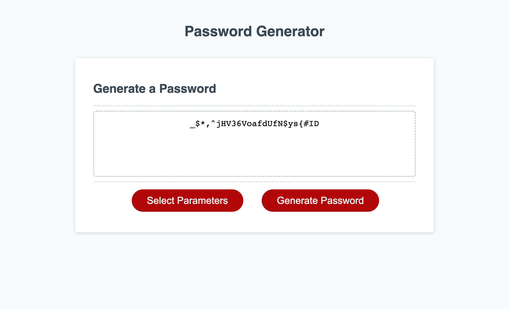

# Password Generator

## Description

This site generates a random password for the user based on specified parameters

## Installation

N/A

## Usage

Click the "Select Parameters" button to set your password parameters (uppercase letters, numbers, special characters, and length). Once the parameters are set, the "Generate Password" button can be used to generate a random password. The user can use this button more than once until a desired password is generated. 

## Credits
Starter Code: https://github.com/coding-boot-camp/friendly-parakeet
## License
